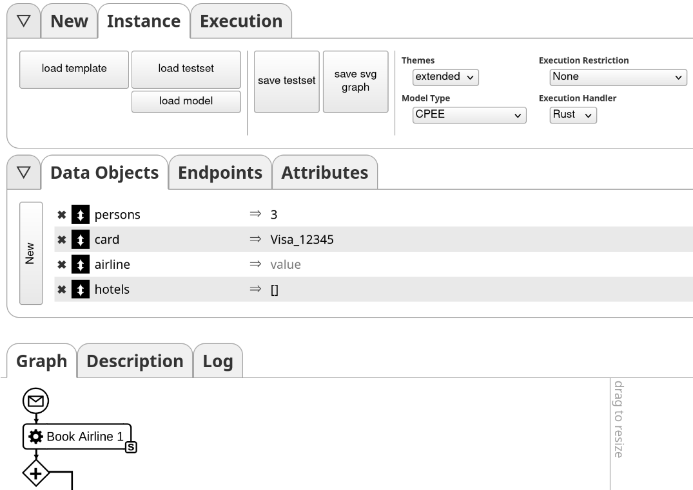

# Rust Process DSL

## Introduction

This projects implements a general purpose Process DSL that can be used to compose and execute arbitrary workflows.
The interfaces of the process model DSL can be found [here](./weel_lib/src/dsl.rs).
The implementation interfaces with different CPEE interfaces that are free and open source and thus can be downloaded and deployed freely.

## Try it out

You can try out modelling and executing process models on our test server [echo](https://echo.bpm.in.tum.de/flow/?new). 
There you can model process models or load templates using the `load template` button in the `Instance` tab at the top of the page.
To use the rust process DSL you need to change the `Execution Handler` in the `Instance` tab to **Rust**.
The process description that is equivalent to the displayed process model can be seen when switching from the `Graph` tab to the `Description` Tab.
Execution of the model can be started using the `Start` button in the `Execution` tab at the top of the page.

## Structure
The [weel_lib](./weel_lib/) crate contains the implementation of the process model DSL.
The [weel_bin](./weel_bin/) binary crate utilizes the implementation to execute Process models.
The `weel_bin` code will inject the process model specified in the [`instance.rs`](./instance.rs) file.

## Compilation
There are multiple scripts available to build the process binary. These are located in the root directory and are named `build_*`.
A good starting point is using the `build_static.sh` to compile the binary and statically linking all dependencies.

The compiled binary requires a configuration and a context file in the same folder. The configuraiton specifies where it can reach
the other components required to execute the process model (e.g. the evaluation helper to execute ruby code, the Redis-like database for persistence, callbacks, and monitoring).
The both files are respectively expected to be JSON files named `opts.json` and `context.json`.
The structure of these JSON files are specified by the `Opts` and `Context` structs specified [here](./weel_lib/src/data_types.rs).

The process model then can be executed using the [run.sh](./run.sh) script located in the process root. Please note that the required files are located in the [binaries location](./target/release/).

## Requirements

-